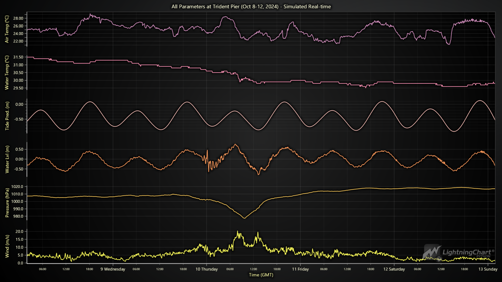

# Tides and Currents Predictions using NOAA's API and LightningChart Python

## Introduction

In October 2024, **Hurricane Milton** made its way across the Atlantic, affecting numerous coastal areas. This project was developed to visualize real-time tides and environmental conditions using **NOAA's Tides and Currents API** data, focusing on the **Trident Pier station in Florida**, which was directly along the hurricane's path. By visualizing this data, we can monitor changes in tides, wind speeds, air pressure, and temperatures to gain insights into how the hurricane impacted coastal areas.

Using **LightningChart Python**, we simulate real-time visualizations of the conditions at **Trident Pier** from October 8–12, 2024. NOAA provides data every 6 minutes, so true real-time plotting isn't feasible. Therefore, we implement a **simulated playback** of the data to mimic live updates.

## LightningChart Python

LightningChart Python is a high-performance data visualization library known for efficiently handling large datasets. LightningChart Python was instrumental in rendering multiple environmental parameters from NOAA's API and simulating real-time data playback in this project. Its flexibility allowed for the seamless integration of various chart types, such as line charts with stacked Y-axes, which visualized wind speeds, water levels, tide predictions, and temperature variations. LightningChart Python's powerful rendering capabilities ensured smooth and responsive updates, even when processing multiple parameters in simulated real-time.

### **Setting Up Python Environment**

To set up the Python environment for this project, you need to install Python and the necessary libraries. This includes installing LightningChart Python and Pandas:

Here's a quick setup guide:

1. **Install Python**: Download and install the latest version of Python from the [official website](https://www.python.org/).
2. **Install Libraries**: Use `pip` to install the required libraries:

   ```bash
   pip install lightningchart pandas
   ```

### **Overview of libraries used**

- **Pandas**: For data manipulation and analysis. ([documentation](https://pandas.pydata.org/docs/))
- **LightningChart Python**: For creating high-performance, interactive data visualizations. ([documentation](https://lightningchart.com/python-charts/docs/))

### Setting Up Your Development Environment

For this project, we used Visual Studio Code, a versatile and powerful code editor that supports Python development. It offers a wide range of extensions for enhancing productivity and ease of use. Here's how to set it up:

1. Install [Visual Studio Code](https://code.visualstudio.com/)
2. Install the Python extension from the Visual Studio Code marketplace
3. Open your project folder and set up the virtual environment by creating a file with a .py
   extension
4. Import necessary libraries into the environment like LightningChart Python and Pandas
5. Ensure that LightningChart Python is properly licensed.

## Setting up NOAA's API

To begin, we configure the environment by defining the API parameters we'll be analyzing. In this case, we focus on data from **Trident Pier** from October 8-12, 2024, as this station was located along Hurricane Milton's path.

```python
import requests 
import time
import pandas as pd
import lightningchart as lc

# API URLs for the parameters
urls = {
    'wind': 'https://api.tidesandcurrents.noaa.gov/api/prod/datagetter?begin_date=20241008&end_date=20241012&station=8721604&product=wind&datum=MHHW&time_zone=gmt&units=metric&format=json',
    'air_pressure': 'https://api.tidesandcurrents.noaa.gov/api/prod/datagetter?begin_date=20241008&end_date=20241012&station=8721604&product=air_pressure&datum=MHHW&time_zone=gmt&units=metric&format=json',
    'water_level': 'https://api.tidesandcurrents.noaa.gov/api/prod/datagetter?begin_date=20241008&end_date=20241012&station=8721604&product=water_level&datum=MHHW&time_zone=gmt&units=metric&format=json',
    'tide_predictions': 'https://api.tidesandcurrents.noaa.gov/api/prod/datagetter?begin_date=20241008&end_date=20241012&station=8721604&product=predictions&datum=MHHW&time_zone=gmt&units=metric&format=json',
    'water_temperature': 'https://api.tidesandcurrents.noaa.gov/api/prod/datagetter?begin_date=20241008&end_date=20241012&station=8721604&product=water_temperature&datum=MHHW&time_zone=gmt&units=metric&format=json',
    'air_temperature': 'https://api.tidesandcurrents.noaa.gov/api/prod/datagetter?begin_date=20241008&end_date=20241012&station=8721604&product=air_temperature&datum=MHHW&time_zone=gmt&units=metric&format=json',
}
```

This section defines the **NOAA API URLs** to fetch data for key parameters like wind speed, air pressure, water level, and temperatures. These parameters help us analyze how Hurricane Milton impacted coastal conditions.

### Fetching Data from NOAA's API

NOAA's API provides updates every 6 minutes, which means that **true real-time visualization** isn't feasible. However, using  **simulated playback** , we can mimic real-time updates by progressively displaying historical data. Below is the method we use to fetch and store the data:

NOAA's API provides updates at regular intervals, specifically every 6 minutes. Due to this, actual **real-time visualization** isn't feasible. However, by simulating the data playback, we can progressively display historical data in a way that mimics real-time updates. Below is the method we use to fetch and store the data:

```python
# Fetch data and store it
data_store = {}
timestamps = []
for param, url in urls.items():
    response = requests.get(url)
    data = response.json()
  
    # Check if the data is under 'data' or 'predictions'
    if 'data' in data:
        data_store[param] = data['data']
    elif 'predictions' in data:
        data_store[param] = data['predictions']
    else:
        print(f"Error: Unexpected structure for {param}. Response: {data}")
        continue

    # Collect all timestamps to find min and max
    for entry in data_store[param]:
        timestamps.append(pd.to_datetime(entry['t']))
```

This method ensures that data fetched using NOAA’s API is stored for each parameter, allowing us to progressively visualize it even though it was collected at regular intervals.

### Chart Configuration

Once the data is collected, we configure **LightningChart Python**. The X-axis is set to **DateTime** format to represent the progression of time, and each parameter gets its own Y-axis to visualize the different units of measurement.

```python
# Find the min and max timestamps
min_time = min(timestamps)
max_time = max(timestamps)

# Convert min and max time to milliseconds for X-axis
min_time_ms = min_time.value / 10**6 
max_time_ms = max_time.value / 10**6

# Create the chart
chart = lc.ChartXY(theme=lc.Themes.Dark)

# Set title for the chart
chart.set_title("All Parameters at Trident Pier (Oct 8-12, 2024) - Simulated Real-time")

# Configure X-axis to use DateTime directly and set interval based on min and max time
x_axis = chart.get_default_x_axis()
x_axis.set_tick_strategy('DateTime')
x_axis.set_interval(min_time_ms, max_time_ms)  # Set X-axis interval
x_axis.set_title("Time (GMT)")
```

This section shows how to configure the **DateTime** X-axis and set the chart's title.

### Adding Y-Axes for Multiple Parameters

To visualize different environmental parameters, we create individual Y-axes for each, labeling them according to the respective unit (e.g., wind speed in m/s, air pressure in hPa, etc.).

```python
# Dispose of the default y-axis to customize with multiple stacked y-axes
chart.get_default_y_axis().dispose()

# Add y-axes with units in their titles
series_list = {}
y_axis_units = {
    'wind': 'Wind (m/s)',
    'air_pressure': 'Pressure (hPa)',
    'water_level': 'Water Lvl (m)',
    'tide_predictions': 'Tide Pred. (m)',
    'water_temperature': 'Water Temp (°C)',
    'air_temperature': 'Air Temp (°C)'
}

for i, (param, _) in enumerate(urls.items()): 
    axis_y = chart.add_y_axis(stack_index=i) # Add a new y-axis for each parameter
    axis_y.set_margins(15 if i > 0 else 0, 15 if i < len(urls) - 1 else 0)   
    axis_y.set_title(y_axis_units[param])  # Add units to the y-axis title
    axis_y.set_interval(0, 1)  # Set initial intervals, update them as data comes in

    # Create a new line series for each y-axis
    series = chart.add_line_series(y_axis=axis_y, data_pattern='ProgressiveX')
    series.set_name(y_axis_units[param])  # Set series name for easy identification
    series_list[param] = series
```

In this snippet, each parameter gets its own Y-axis, allowing us to visualize **wind speed**, **air pressure**, **water levels**, and **temperature** side by side. These visualizations highlight changes as **Hurricane Milton** approaches and moves past Trident Pier.

### Real-Time Data Plotting

Given that NOAA provides data at fixed intervals rather than in real time, we recreate the experience of live monitoring by simulating the plotting of pre-fetched data. We simulate playback by introducing a slight delay between data points, ensuring smooth and continuous visualization.

```python
# Open the live chart
chart.open(live=True)

# Simulate real-time plotting using pre-fetched data
for i in range(len(data_store['wind'])):  # Iterate through the fetched data
    for param, series in series_list.items():
        # Extract the appropriate value for each parameter
        entry = data_store[param][i]
        timestamp = pd.to_datetime(entry['t'])  # Get the timestamp in datetime format
        x_value = timestamp.value / 10**6  # Convert pandas timestamp to milliseconds

        # Handle different parameters based on their field names
        if param == 'wind':
            value_str = entry['s']  # Wind speed uses 's'
        elif param in ['air_pressure', 'water_level', 'tide_predictions', 'water_temperature', 'air_temperature']:
            value_str = entry['v']  # Other parameters use 'v' for value

        # Ensure the value is not empty before converting to float
        if value_str and value_str != '':
            y_value = float(value_str)  # Convert to float only if value is valid

            # Add the new value to the corresponding series
            series.add(x_value, y_value)
        else:
            print(f"Missing or invalid data for {param} at time {timestamp}")

    time.sleep(0.03) # Add a slight delay to simulate real-time plotting
```

This section demonstrates how we implement the playback simulation by delaying the plotting of each data point, giving the impression of real-time updates despite the inherent delay in data collection.

## Final Result



 

### Interpreting the Data

During **Hurricane Milton**, the data reveals clear changes in wind speed, air pressure, and water levels:

* **Wind Speed** : Winds were relatively calm before Hurricane Milton's arrival. On October 10, wind speeds peaked at  **20.4 m/s** , indicating strong gusts as the hurricane passed. This marked the highest wind speed during the period, demonstrating the intensity of the hurricane.
* **Air Pressure** : As expected with any major storm, air pressure dropped significantly during Hurricane Milton's passage. The lowest recorded air pressure was  **977.2 hPa**, also on October 10 at around 09:30 GMT, which coincided with the hurricane's closest approach to Trident Pier. This pressure drop is a hallmark of the eye of the hurricane passing through.
* **Water Level** : The water level reached its peak at **0.77 meters above MHHW** on October 10. This increase in water level, combined with strong winds, posed a heightened risk of storm surge in coastal areas. The water level fluctuations on the 10th reflect the impact of tidal changes combined with the storm's force.
* **Air Temperature** : A notable drop in air temperature occurred on the morning of October 10. Temperatures fell from **28.50°C** at around 04:50 to **22.60°C** by 09:30, which coincided with the lowest pressure point and the peak in wind speeds. This sharp decline in temperature highlights the cold air being pulled into the hurricane system.
* **Water Temperature** : Water temperature remained relatively stable during this period, hovering between  **30.50°C and 31.00°C** . This is typical for coastal waters, which tend to have more gradual temperature fluctuations than air.
* **Tide Predictions** : Tide predictions followed their expected cyclical pattern, but the actual **water level** was consistently higher than predicted due to the storm's influence. This discrepancy highlights how hurricanes can dramatically alter sea conditions beyond typical tidal patterns.

The chart of these environmental conditions helps us visualize the impact of the hurricane, despite the 6-minute delay in NOAA's real-time data. Additionally, the data clearly shows the interplay of environmental factors during a hurricane, and the sharp changes in wind, pressure, and temperature emphasize the strength of **Hurricane Milton** as it passed over Trident Pier in Florida.

## Conclusion

This project demonstrates the usage of NOAA's Tides and Currents API alongside **LightningChart Python** to create detailed, interactive visualizations of environmental conditions. By simulating real-time data, we can track how **Hurricane Milton** affected Trident Pier and nearby coastal areas. This approach offers insights into coastal changes during severe weather events, helping users anticipate and respond to such events.
